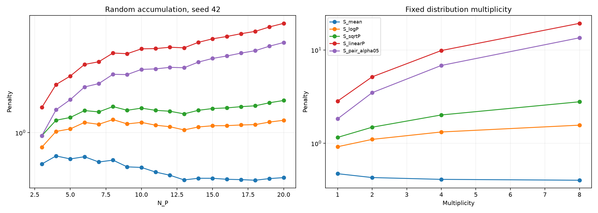
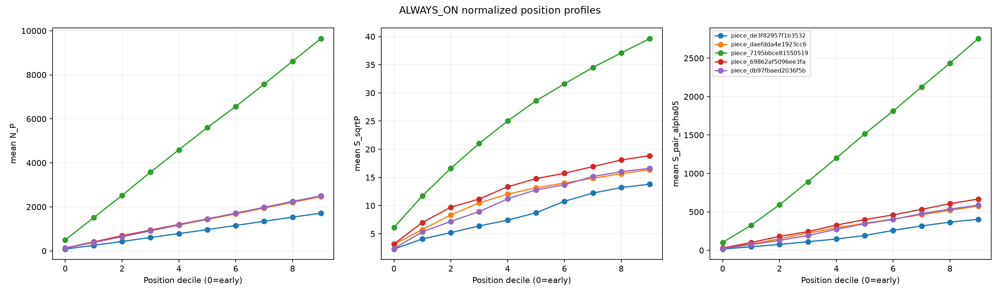

# Hall-Negative Count-Aware Scaling Audit v0

## Scope and frozen semantics

This is a descriptive validation-only audit over the already fixed five pieces. No piece was selected using a harmonic score. The 36 overlapping piece/system rows reuse the exact Pure Hall v0 input inventory. Mephisto Waltz reuses seven existing stored system MIDIs. Because that prior Pure Hall audit deferred this long form and has no stored extreme files, NO_PEDAL and ALWAYS_ON are evaluated as in-memory logical CC64 controls over the existing canonical Stage1 stream; no MIDI is written.

- Tested command: python /workspace/project/scripts/audit_hall_negative_count_scaling_v0.py --output /workspace/project/analysis/hall_negative_count_scaling_audit_v0 --workers 4
- Piece count: 5
- System count per piece: 9
- Real onset rows: 164685
- Test access / inference / training / new MIDI generation: 0 / 0 / 0 / 0
- Fixed selection SHA-256: f8ba41f85fb3037718a78aa7475b41218241cd4988630fe5f0a6f7ce842e7b6f
- Prior Pure Hall input manifest SHA-256: 1d247428af2e3ed2a79e3dcc3f15339a3e10925f5ddcd18b6e859797f3923ed5
- CUSTOM_EVENT_V0 is separate from the four-system canonical median because its non-CC64 stream differs.

| Composer | Title | piece ID | fixed human performance | systems | virtual controls |
| --- | --- | --- | --- | --- | --- |
| Ravel | Pavane | piece_de3f82957f1b3532 | Ravel/Pavane/ChenS03.mid | 9 | none |
| Schumann | Arabeske | piece_daefdda4e1923cc6 | Schumann/Arabeske/Min09M.mid | 9 | none |
| Liszt | Mephisto_Waltz | piece_7195bbce81550519 | Liszt/Mephisto_Waltz/Avdeeva03.mid | 9 | NO_PEDAL, ALWAYS_ON |
| Beethoven | Piano_Sonatas_27-1 | piece_69862af5096ee3fa | Beethoven/Piano_Sonatas/27-1/Abdelmola01.mid | 9 | none |
| Chopin | Etudes_op_25_12 | piece_db97fbaed2036f5b | Chopin/Etudes_op_25/12/Atzinger03.mid | 9 | none |

At each onset, A is key-held notes, P is key-off notes retained by sustain, and Q is P×A union choose(P,2); A-A is excluded. CC64 ON is >=64. RAW is the sum of max(-HallWeight,0), and H_MEAN=RAW/N_Q. Q-empty onsets are zero. There is no decay, velocity, register/dynamic term, positive reward, or PA/PP differential weight.

N_P counts notes retained by the pedal. N_Q counts pedal-induced harmonic relations. N_Q can grow through large active polyphony with small P (PA), or combinatorially through large P (PP); these are intentionally audited as different concepts.

## Synthetic A — random accumulation

Seed 42, MIDI range 36–96, one fixed 20-note random sequence accumulated from 3 to 20 residual notes. Local decreases are retained rather than smoothed.

| N | N_Q | RAW | S_mean | S_logP | S_sqrtP | S_linearP | S_pair_a05 |
| --- | --- | --- | --- | --- | --- | --- | --- |
| 3 | 3 | 1.633 | 0.544 | 0.755 | 0.943 | 1.633 | 0.943 |
| 4 | 6 | 3.819 | 0.636 | 1.024 | 1.273 | 2.546 | 1.559 |
| 5 | 10 | 6.005 | 0.601 | 1.076 | 1.343 | 3.003 | 1.899 |
| 6 | 15 | 9.404 | 0.627 | 1.220 | 1.536 | 3.762 | 2.428 |
| 7 | 21 | 11.881 | 0.566 | 1.176 | 1.497 | 3.960 | 2.593 |
| 8 | 28 | 16.426 | 0.587 | 1.289 | 1.659 | 4.693 | 3.104 |
| 9 | 36 | 18.534 | 0.515 | 1.185 | 1.544 | 4.633 | 3.089 |
| 10 | 45 | 22.913 | 0.509 | 1.221 | 1.610 | 5.092 | 3.416 |
| 11 | 55 | 25.583 | 0.465 | 1.156 | 1.543 | 5.117 | 3.450 |
| 12 | 66 | 28.880 | 0.438 | 1.122 | 1.516 | 5.251 | 3.555 |
| 13 | 78 | 31.166 | 0.400 | 1.054 | 1.441 | 5.194 | 3.529 |
| 14 | 91 | 37.540 | 0.413 | 1.117 | 1.544 | 5.775 | 3.935 |
| 15 | 105 | 43.311 | 0.412 | 1.144 | 1.598 | 6.187 | 4.227 |
| 16 | 120 | 48.539 | 0.404 | 1.146 | 1.618 | 6.472 | 4.431 |
| 17 | 136 | 54.649 | 0.402 | 1.161 | 1.657 | 6.831 | 4.686 |
| 18 | 153 | 60.759 | 0.397 | 1.169 | 1.685 | 7.148 | 4.912 |
| 19 | 171 | 70.128 | 0.410 | 1.229 | 1.788 | 7.792 | 5.363 |
| 20 | 190 | 79.384 | 0.418 | 1.272 | 1.869 | 8.356 | 5.759 |

## Synthetic B — controlled multiplicity

The base pitch distribution is 48 49 52 55 59 62 and each note-instance count is multiplied by 1, 2, 4, and 8. Same-pitch pairs make finite-size H_MEAN only approximately constant, while the pitch-class mixture is fixed.

| x | N_P | N_Q | RAW | S_mean | S_logP | S_sqrtP | S_linearP | S_pair_a05 |
| --- | --- | --- | --- | --- | --- | --- | --- | --- |
| 1 | 6 | 15 | 7.095 | 0.473 | 0.920 | 1.159 | 2.838 | 1.832 |
| 2 | 12 | 66 | 28.380 | 0.430 | 1.103 | 1.490 | 5.160 | 3.493 |
| 4 | 24 | 276 | 113.520 | 0.411 | 1.324 | 2.015 | 9.871 | 6.833 |
| 8 | 48 | 1128 | 454.080 | 0.403 | 1.567 | 2.789 | 19.323 | 13.520 |

Observed x8/x1 growth: S_mean=0.85×, logP=1.70×, sqrtP=2.41×, linearP=6.81×, pair-alpha05=7.38×. The alpha=0.5 score is partial normalization, not raw mass.

## Real-data primary piece means

Values are piece-balanced means of the all-distinct-onset piece summaries; lower is better. Valid-interaction means remain in piece_system_count_scaling.csv.

| System | mean | logP | sqrtP | linearP | pair-a05 | mean N_P | mean N_Q |
| --- | --- | --- | --- | --- | --- | --- | --- |
| NO_PEDAL | 0.000 | 0.000 | 0.000 | 0.000 | 0.000 | 0.0 | 0.0 |
| ALWAYS_ON | 0.330 | 2.378 | 13.760 | 717.101 | 507.549 | 1978.8 | 4226518.8 |
| STANDARD_CE_ARGMAX | 0.101 | 0.227 | 0.327 | 1.402 | 1.114 | 7.5 | 132.0 |
| STANDARD_CE_POSTERIOR_MEDIAN | 0.100 | 0.223 | 0.324 | 1.396 | 1.108 | 7.5 | 135.9 |
| WEIGHTED_CE_ARGMAX | 0.092 | 0.199 | 0.283 | 1.152 | 0.924 | 6.4 | 108.1 |
| HYBRID_REGRESSION_ONLY | 0.099 | 0.233 | 0.344 | 1.590 | 1.252 | 8.2 | 168.0 |
| CUSTOM_EVENT_V0 | 0.148 | 0.317 | 0.473 | 2.279 | 1.803 | 9.1 | 234.1 |
| ORIGINAL_PT | 0.145 | 0.362 | 0.560 | 3.034 | 2.332 | 13.5 | 386.8 |
| HUMAN | 0.159 | 0.336 | 0.467 | 1.746 | 1.449 | 8.2 | 127.4 |

## Ordering diagnostic

Canonical Model is the within-piece median of the four canonical Stage2 systems. CUSTOM_EVENT_V0 is excluded.

| scaling | Human<PT | PT<Model | Model<Always | Full chain | Always p99/median |
| --- | --- | --- | --- | --- | --- |
| S_mean | 1/5 | 2/5 | 5/5 | 0/5 | 1.17 |
| S_logP | 2/5 | 2/5 | 5/5 | 0/5 | 1.44 |
| S_sqrtP | 3/5 | 1/5 | 5/5 | 0/5 | 2.61 |
| S_linearP | 5/5 | 1/5 | 5/5 | 1/5 | 5.80 |
| S_pair_alpha05 | 5/5 | 1/5 | 5/5 | 1/5 | 5.79 |

Model<ALWAYS is already saturated at 5/5 for S_mean and remains 5/5 for S_sqrtP, so count scaling does not improve this ordering count. It enlarges the median ALWAYS/model-median magnitude ratio from 3.49x (S_mean) to 11.70x (logP), 41.17x (sqrtP), 376.31x (linearP), and 325.06x (pair-alpha05). These are margins, not accuracy gains.

## Explosion diagnostics

Pooled ALWAYS_ON onset magnitudes are below. The final column is the mean per-piece share of total score mass carried by the top 1% of onsets.

| scaling | median | p90 | p95 | p99 | max | p99/median | top1% mass |
| --- | --- | --- | --- | --- | --- | --- | --- |
| S_mean | 0.346 | 0.398 | 0.402 | 0.404 | 0.405 | 1.17 | 0.011 |
| S_logP | 2.579 | 3.587 | 3.662 | 3.719 | 3.731 | 1.44 | 0.012 |
| S_sqrtP | 15.474 | 35.885 | 38.359 | 40.324 | 40.770 | 2.61 | 0.016 |
| S_linearP | 694.692 | 3231.250 | 3663.617 | 4026.126 | 4112.135 | 5.80 | 0.021 |
| S_pair_alpha05 | 491.699 | 2284.980 | 2590.994 | 2847.746 | 2908.719 | 5.79 | 0.021 |

S_linearP pooled p99/median is 5.80; S_pair_alpha05 is 5.79. Neither is driven by only a handful of isolated onsets: the top 1% carries about 2.1% of total ALWAYS_ON score mass. Instead, both show strong systematic late-position growth (five-piece bin-9 means: linearP=1410.5, pair-alpha05=998.0). This is substantial scale expansion, though not a many-orders-of-magnitude outlier explosion.

## Normalized position profile — ALWAYS_ON

Each performance is split into ten equal-count onset bins, then the five piece-bin means are averaged for this compact view. The full piece/system table is normalized_position_profile.csv.

| bin | N_P | N_Q | H_MEAN | logP | sqrtP | linearP | pair-a05 |
| --- | --- | --- | --- | --- | --- | --- | --- |
| 0 | 193.9 | 41670.5 | 0.263 | 1.291 | 3.417 | 54.989 | 39.280 |
| 1 | 586.7 | 291316.2 | 0.295 | 1.817 | 6.779 | 177.183 | 125.744 |
| 2 | 986.6 | 799347.0 | 0.313 | 2.100 | 9.416 | 319.195 | 226.227 |
| 3 | 1391.8 | 1588813.2 | 0.324 | 2.282 | 11.603 | 469.877 | 332.757 |
| 4 | 1788.6 | 2609406.6 | 0.339 | 2.478 | 13.801 | 633.394 | 448.295 |
| 5 | 2181.0 | 3875042.7 | 0.347 | 2.605 | 15.613 | 792.636 | 560.894 |
| 6 | 2565.0 | 5323463.2 | 0.352 | 2.700 | 17.167 | 944.283 | 668.176 |
| 7 | 2963.6 | 7094870.5 | 0.358 | 2.795 | 18.738 | 1107.129 | 783.386 |
| 8 | 3368.6 | 9171404.3 | 0.358 | 2.844 | 20.017 | 1262.750 | 893.388 |
| 9 | 3764.5 | 11476875.2 | 0.355 | 2.864 | 21.062 | 1410.535 | 998.024 |

## N_P versus N_Q

| System | mean N_P | mean N_Q | PP pair fraction | corr sqrtP/pair-a05 valid |
| --- | --- | --- | --- | --- |
| NO_PEDAL | 0.00 | 0.00 | 0.000 | — |
| ALWAYS_ON | 1978.77 | 4226518.82 | 0.997 | 0.981 |
| STANDARD_CE_ARGMAX | 7.46 | 132.02 | 0.755 | 0.918 |
| STANDARD_CE_POSTERIOR_MEDIAN | 7.54 | 135.92 | 0.756 | 0.920 |
| WEIGHTED_CE_ARGMAX | 6.42 | 108.11 | 0.739 | 0.930 |
| HYBRID_REGRESSION_ONLY | 8.16 | 167.98 | 0.763 | 0.918 |
| CUSTOM_EVENT_V0 | 9.07 | 234.07 | 0.710 | 0.950 |
| ORIGINAL_PT | 13.45 | 386.79 | 0.883 | 0.928 |
| HUMAN | 8.25 | 127.37 | 0.757 | 0.935 |

Across all valid real-data onsets, corr(S_sqrtP, S_pair_alpha05)=0.963, so pair-count scaling adds limited independent behavior overall. The weakest piece/system correlation is 0.856 for Schumann/Arabeske / HYBRID_REGRESSION_ONLY, where PP contributes only 0.421 of Q: this PA-heavier texture is the clearest divergence. High active polyphony can increase N_Q through PA without a matching increase in N_P; high residual accumulation increases both PA and combinatorial PP. Piece/system-specific correlations and N_P/N_Q quantiles are in piece_system_count_scaling.csv.

## Sanity

| check | status | detail |
| --- | --- | --- |
| S_mean_reproduces_prior_Pure_Hall | PASS | rows=82152; max_abs_error=0.000e+00 |
| alpha05_three_way_identity | PASS | max_abs_error=9.095e-13 |
| Q_empty_all_scores_zero | PASS | rows=72612 |
| NO_PEDAL_all_scores_zero | PASS | rows=18261 |
| no_decay_used | PASS | compact pitch-count Hall lookup only |
| no_velocity_used | PASS | score reads pitch/state/count only |
| no_low_or_dynamic_terms | PASS | absent |
| no_PA_PP_differential_weights | PASS | PA and PP multiplicities both weight 1 |
| positive_Hall_zero_not_reward | PASS | max(-HallWeight,0) |
| no_AA_pairs | PASS | AA_pair_count=0 |
| all_finite | PASS | numeric_cells=2799645 |
| source_MIDI_unchanged | PASS | manifest_rows=45; unique_files=43 |
| TEST_access_zero | PASS | count=0 |
| inference_zero | PASS | count=0 |
| training_zero | PASS | count=0 |
| new_MIDI_generation_zero | PASS | count=0 |
| no_explicit_real_pair_materialization | PASS | 128-bin pitch multiplicities with compact PA outer-count and PP triangular-count |
| fixed_piece_system_inventory | PASS | pieces=5; systems=9; rows=45 |
| CUSTOM_EVENT_kept_separate | PASS | excluded from canonical model median |

All checks must pass before this report is written. Source MIDI hashes are checked before and after evaluation.

## Final questions

### Q1 — Does pair-average underrepresent accumulation?

Yes for the narrow hypothesis being tested. Controlled multiplicity leaves S_mean near its finite-size severity level (x8/x1=0.85×) while raw relation mass and count-aware scores grow. S_mean therefore cannot express how many similarly severe pedal-induced relations are simultaneously present.

### Q2 — Does N_P improve extreme over-pedaling detection?

It increases the numerical separation from ALWAYS_ON, but not ordering coverage: model-median<ALWAYS is already 5/5 under S_mean and remains 5/5 under sqrt(N_P). The added value here is margin, not another correctly ordered piece. HUMAN/PT and PT/model behavior must therefore carry more weight in judging the tradeoff.

### Q3 — log, sqrt, or linear N_P?

S_sqrtP is the most reasonable middle behavior here. LogP grows gently and can leave large accumulations under-emphasized; linearP grows strongly and produces the largest absolute/tail magnitudes. SqrtP adds visible count sensitivity without inheriting the full linear explosion.

### Q4 — alpha=0.5 pair-count scaling?

It behaves approximately linearly in controlled multiplicity because sqrt(N_Q) tracks note count when PP dominates. Its x8/x1 growth is 7.38x, close to linearP's 6.81x, and their ALWAYS_ON p99/median ratios are likewise nearly equal (5.79 versus 5.80). It is partial normalization, not raw mass, and in PP-dominant accumulation behaves almost like a rescaled linear-N_P penalty.

### Q5 — Is sqrt(N_P) meaningfully different from sqrt(N_Q)?

The pooled valid-onset correlation is 0.963, so they are usually very similar in rank behavior, although their magnitudes differ. The clearest divergence is the PA-heavier Schumann/Arabeske / HYBRID_REGRESSION_ONLY cell (correlation 0.856); N_Q then responds to active polyphony that N_P alone does not encode. On these five pieces, that is limited rather than a broad independent signal.

### Q6 — Best balance?

For the combined criteria in this audit, S_logP is the most conservative balance: it increases extreme-separation margin, has modest controlled growth and tail ratio, and does not worsen the 2/5 PT<model-median count seen under S_mean. S_sqrtP is the clearer stronger-sensitivity alternative and is the best middle growth curve in isolation, but here PT<model-median falls to 1/5. S_linearP and pair-alpha05 are useful stress diagnostics; their strong late-position scale growth makes them less attractive as default formulations.

### Q7 — Final formula now?

No. This fixed five-piece audit has no perceptual ground truth and was not a parameter-fitting exercise. It only narrows which numerical behavior deserves manual/listening validation. Larger note count is not inherently bad; the tested hypothesis is conditional on similar Hall-negative average severity.
