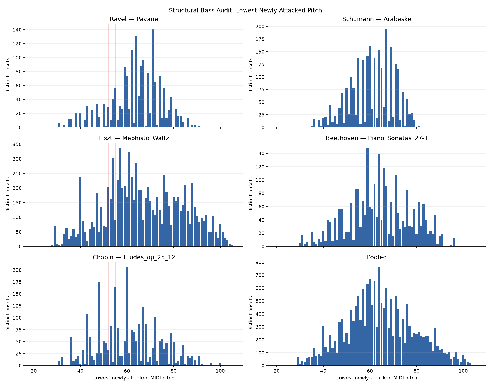
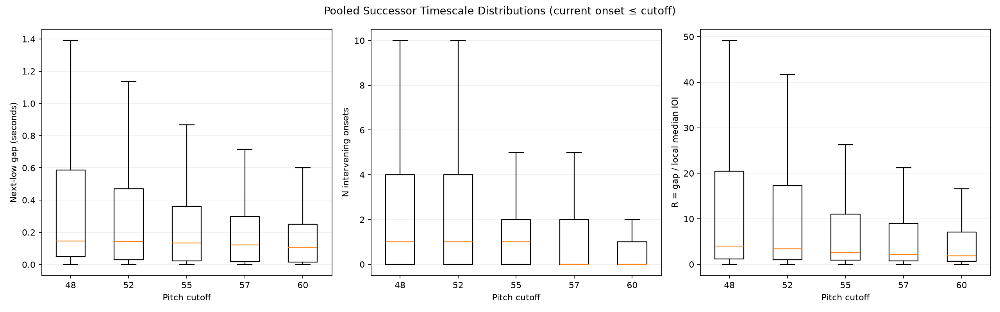
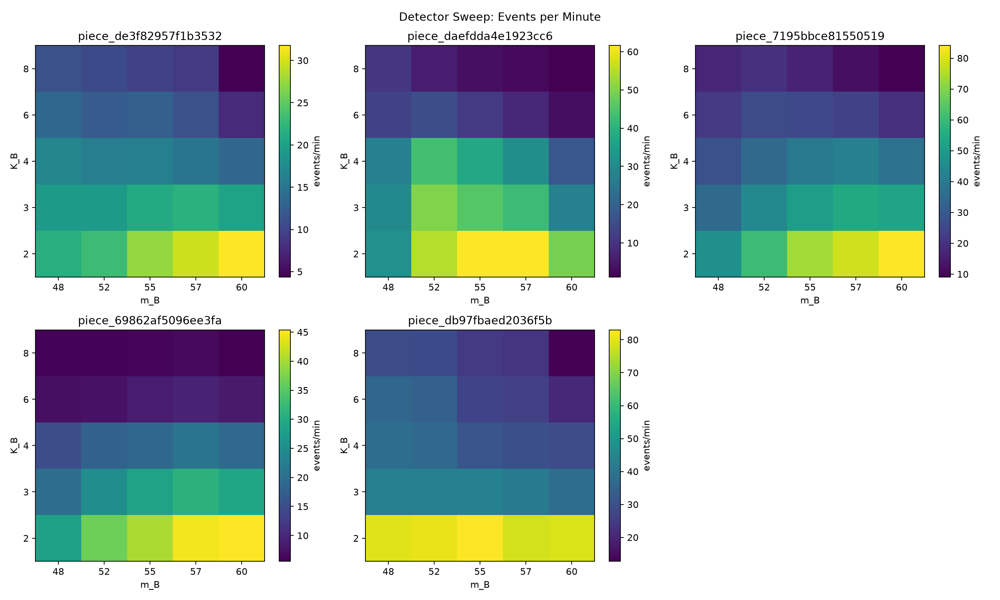
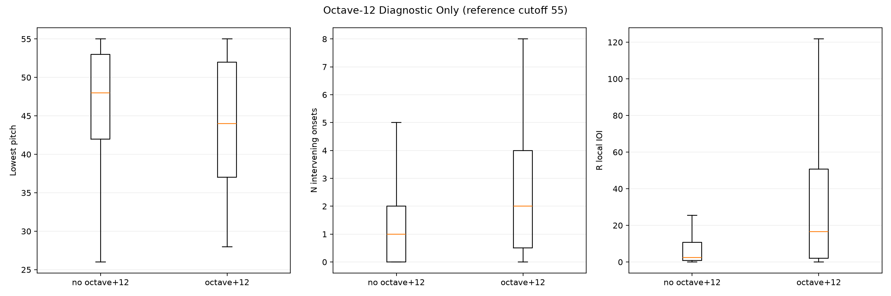

# Structural Bass Event Detector v0 — Five-Performance Data Audit

## Scope and safeguards

This exploratory audit uses exactly five human performances from the canonical ASAP validation manifest. It does not train a model, use score annotations, access a test MIDI, separate voices, segment phrases, or calculate precision/recall. CC64, key-off, and performed note duration are absent from every detector feature. Octave reinforcement is diagnostic only.

- Canonical split manifest: `/workspace/project/analysis/stage2_encoder_only_v0/asap_split.csv`
- Manifest SHA-256: `d1fe379eb123ff7abca93773296f735f40a215dcd6e6363b55756383708c965b`
- Canonical validation universe verified: 71 performances / 19 pieces
- Selection rule: first row in canonical validation-manifest order for each exact target piece
- MIDI files opened: exactly 5 selected validation performances
- ASAP test MIDI access count: **0**
- Tested command: `python /workspace/project/scripts/audit_structural_bass_event_detector_v0.py --output /workspace/project/analysis/structural_bass_event_detector_v0`

| Composer | Title | piece ID | human performance MIDI path | validation performances | chosen ordinal |
| --- | --- | --- | --- | --- | --- |
| Ravel | Pavane | piece_de3f82957f1b3532 | Ravel/Pavane/ChenS03.mid | 2 | first |
| Schumann | Arabeske | piece_daefdda4e1923cc6 | Schumann/Arabeske/Min09M.mid | 2 | first |
| Liszt | Mephisto_Waltz | piece_7195bbce81550519 | Liszt/Mephisto_Waltz/Avdeeva03.mid | 14 | first |
| Beethoven | Piano_Sonatas_27-1 | piece_69862af5096ee3fa | Beethoven/Piano_Sonatas/27-1/Abdelmola01.mid | 7 | first |
| Chopin | Etudes_op_25_12 | piece_db97fbaed2036f5b | Chopin/Etudes_op_25/12/Atzinger03.mid | 9 | first |

## Method

The audit reuses `src.stage2_event_tokenizer.tokenizer.parse_raw_midi` for the canonical distinct-onset ticks and the existing deterministic tempo converter. Group pitches are collected independently from raw non-drum `note_on velocity>0` messages, without consulting note-off messages. All five sources passed an exact equality assertion between these raw attack ticks and parser `distinct_onsets`. At each group, `p_n` is the minimum newly attacked pitch only.

Local median IOI reuses `scripts.audit_pedal_event_metric_tolerance_mini.local_ioi` with `window=16`, corresponding to up to eight distinct onsets on each side. Only positive, tempo-aware IOIs are included. Successor values are missing when no later low attack exists; no sentinel is substituted. Distribution summaries for a cutoff use current onsets with `p_n <= cutoff`; missing terminal successors remain counted separately. Events/minute uses first-to-last distinct-onset span and therefore does not use note duration.

| Piece | distinct onsets | newly attacked notes | onset span sec |
| --- | --- | --- | --- |
| Ravel — Pavane | 1715 | 1789 | 370.3 |
| Schumann — Arabeske | 2520 | 2582 | 379.9 |
| Liszt — Mephisto_Waltz | 9112 | 9643 | 667.3 |
| Beethoven — Piano_Sonatas_27-1 | 2532 | 2628 | 334.5 |
| Chopin — Etudes_op_25_12 | 2550 | 2589 | 136.6 |

## Pitch distribution

The “main range” below is the empirical 5th–95th percentile interval; full integer-pitch histograms are in `pitch_histogram.csv` and `pitch_histogram.png`.

| Scope | onsets | Q1 | median | Q3 | main range (P05–P95) |
| --- | --- | --- | --- | --- | --- |
| Ravel — Pavane | 1715 | 59.0 | 64.0 | 71.0 | 42.7–81.0 |
| Schumann — Arabeske | 2520 | 55.0 | 62.0 | 69.0 | 44.0–76.0 |
| Liszt — Mephisto_Waltz | 9112 | 56.0 | 65.0 | 81.0 | 40.0–95.0 |
| Beethoven — Piano_Sonatas_27-1 | 2532 | 55.0 | 64.0 | 74.0 | 42.0–86.0 |
| Chopin — Etudes_op_25_12 | 2550 | 50.0 | 60.0 | 71.0 | 39.0–84.0 |
| Pooled | 18429 | 55.0 | 64.0 | 74.0 | 40.0–90.0 |

## Structural timescale distributions

Each cell reports median and, where shown, Q1–Q3. `low n` is the number of current onsets satisfying the cutoff and `missing` is the number without a later low successor.

| Scope | m_cut | low n | missing | gap med s | gap Q1–Q3 | N med | N Q1–Q3 | R med | R Q1–Q3 |
| --- | --- | --- | --- | --- | --- | --- | --- | --- | --- |
| Ravel — Pavane | 48 | 190 | 1 | 1.681 | 0.084–2.610 | 4.0 | 1.0–12.0 | 33.02 | 1.88–114.57 |
| Ravel — Pavane | 52 | 254 | 1 | 0.813 | 0.023–2.186 | 2.0 | 0.0–8.0 | 19.29 | 0.91–86.23 |
| Ravel — Pavane | 55 | 361 | 1 | 0.630 | 0.016–1.604 | 1.0 | 0.0–4.0 | 5.62 | 0.82–64.24 |
| Ravel — Pavane | 57 | 402 | 1 | 0.561 | 0.016–1.374 | 1.0 | 0.0–3.0 | 7.04 | 0.82–60.86 |
| Ravel — Pavane | 60 | 588 | 1 | 0.454 | 0.012–0.827 | 1.0 | 0.0–2.0 | 3.16 | 0.70–37.04 |
| Schumann — Arabeske | 48 | 268 | 1 | 0.639 | 0.352–1.360 | 4.0 | 2.0–8.0 | 5.96 | 4.11–16.02 |
| Schumann — Arabeske | 52 | 480 | 1 | 0.552 | 0.339–0.790 | 4.0 | 1.0–5.0 | 5.55 | 3.64–11.01 |
| Schumann — Arabeske | 55 | 720 | 1 | 0.406 | 0.128–0.639 | 2.0 | 0.0–4.0 | 4.28 | 1.30–7.01 |
| Schumann — Arabeske | 57 | 860 | 1 | 0.297 | 0.039–0.564 | 1.0 | 0.0–3.0 | 3.16 | 0.81–6.48 |
| Schumann — Arabeske | 60 | 1173 | 1 | 0.225 | 0.036–0.384 | 1.0 | 0.0–2.0 | 2.00 | 0.75–5.04 |
| Liszt — Mephisto_Waltz | 48 | 1229 | 1 | 0.135 | 0.015–0.276 | 1.0 | 0.0–4.0 | 5.40 | 0.98–24.00 |
| Liszt — Mephisto_Waltz | 52 | 1703 | 1 | 0.134 | 0.011–0.239 | 1.0 | 0.0–3.0 | 4.22 | 0.90–21.04 |
| Liszt — Mephisto_Waltz | 55 | 2260 | 1 | 0.135 | 0.011–0.269 | 0.0 | 0.0–3.0 | 3.52 | 0.91–15.82 |
| Liszt — Mephisto_Waltz | 57 | 2824 | 1 | 0.123 | 0.009–0.221 | 0.0 | 0.0–2.0 | 2.50 | 0.75–11.24 |
| Liszt — Mephisto_Waltz | 60 | 3399 | 1 | 0.108 | 0.009–0.190 | 0.0 | 0.0–2.0 | 2.05 | 0.67–9.30 |
| Beethoven — Piano_Sonatas_27-1 | 48 | 364 | 1 | 0.222 | 0.013–0.681 | 1.0 | 0.0–3.0 | 4.72 | 1.00–31.42 |
| Beethoven — Piano_Sonatas_27-1 | 52 | 483 | 1 | 0.212 | 0.013–0.470 | 1.0 | 0.0–3.0 | 4.03 | 0.89–25.52 |
| Beethoven — Piano_Sonatas_27-1 | 55 | 667 | 1 | 0.195 | 0.013–0.425 | 1.0 | 0.0–2.0 | 2.38 | 0.80–18.88 |
| Beethoven — Piano_Sonatas_27-1 | 57 | 764 | 1 | 0.187 | 0.013–0.410 | 1.0 | 0.0–2.0 | 2.26 | 0.80–17.33 |
| Beethoven — Piano_Sonatas_27-1 | 60 | 1019 | 1 | 0.170 | 0.011–0.304 | 0.0 | 0.0–1.0 | 1.94 | 0.75–13.05 |
| Chopin — Etudes_op_25_12 | 48 | 574 | 1 | 0.115 | 0.081–0.170 | 1.0 | 0.0–2.0 | 2.29 | 1.57–3.91 |
| Chopin — Etudes_op_25_12 | 52 | 729 | 1 | 0.102 | 0.059–0.147 | 1.0 | 0.0–2.0 | 2.03 | 1.12–3.29 |
| Chopin — Etudes_op_25_12 | 55 | 983 | 1 | 0.088 | 0.041–0.126 | 0.0 | 0.0–1.0 | 1.72 | 0.86–2.72 |
| Chopin — Etudes_op_25_12 | 57 | 1082 | 1 | 0.084 | 0.037–0.119 | 0.0 | 0.0–1.0 | 1.63 | 0.80–2.58 |
| Chopin — Etudes_op_25_12 | 60 | 1359 | 1 | 0.081 | 0.033–0.111 | 0.0 | 0.0–1.0 | 1.55 | 0.70–2.42 |
| Pooled | 48 | 2625 | 5 | 0.147 | 0.048–0.586 | 1.0 | 0.0–4.0 | 4.02 | 1.20–20.44 |
| Pooled | 52 | 3649 | 5 | 0.144 | 0.028–0.471 | 1.0 | 0.0–4.0 | 3.44 | 1.04–17.30 |
| Pooled | 55 | 4991 | 5 | 0.135 | 0.021–0.360 | 1.0 | 0.0–2.0 | 2.51 | 0.91–11.07 |
| Pooled | 57 | 5932 | 5 | 0.122 | 0.018–0.297 | 0.0 | 0.0–2.0 | 2.17 | 0.78–8.95 |
| Pooled | 60 | 7538 | 5 | 0.107 | 0.016–0.250 | 0.0 | 0.0–1.0 | 1.88 | 0.69–7.06 |

The complete machine-readable table, including P05/P95, is `distribution_summary.csv`.

## Candidate threshold counts

For compactness this report shows the central diagnostic cutoff `m_B=55`; each cell is count and percent among all current low-register onsets. Every cutoff × K × piece/pooled result is in `timescale_threshold_summary.csv`.

| Piece | K=2 | K=3 | K=4 | K=6 | K=8 |
| --- | --- | --- | --- | --- | --- |
| Ravel — Pavane | 169 (46.8%) | 130 (36.0%) | 100 (27.7%) | 79 (21.9%) | 60 (16.6%) |
| Schumann — Arabeske | 390 (54.2%) | 289 (40.1%) | 238 (33.1%) | 72 (10.0%) | 23 (3.2%) |
| Liszt — Mephisto_Waltz | 820 (36.3%) | 569 (25.2%) | 437 (19.3%) | 285 (12.6%) | 181 (8.0%) |
| Beethoven — Piano_Sonatas_27-1 | 225 (33.7%) | 159 (23.8%) | 105 (15.7%) | 48 (7.2%) | 34 (5.1%) |
| Chopin — Etudes_op_25_12 | 189 (19.2%) | 99 (10.1%) | 71 (7.2%) | 61 (6.2%) | 56 (5.7%) |

At pooled `m_B=55`: K=2: 1793 (35.9%), K=3: 1246 (25.0%), K=4: 951 (19.1%), K=6: 545 (10.9%), K=8: 354 (7.1%).

## Detector sweep

`detector_sweep.csv` contains all 25 combinations for each of five pieces plus pooled results. It reports detected count, events/minute, fraction of all onsets, and octave+12/+24 diagnostic rates. The table below is a readable center-point slice (`m_B=55`, `K_B=4`), not a selected final detector.

| Piece | events | events/min | all-onset rate | octave+12 | octave+24 |
| --- | --- | --- | --- | --- | --- |
| Ravel — Pavane | 100 | 16.21 | 5.8% | 1.0% | 0.0% |
| Schumann — Arabeske | 238 | 37.59 | 9.4% | 0.0% | 0.0% |
| Liszt — Mephisto_Waltz | 437 | 39.29 | 4.8% | 4.1% | 0.2% |
| Beethoven — Piano_Sonatas_27-1 | 105 | 18.84 | 4.1% | 0.0% | 0.0% |
| Chopin — Etudes_op_25_12 | 71 | 31.18 | 2.8% | 0.0% | 0.0% |

## Manual inspection set

`manual_inspection_candidates.csv` contains 90 rows (18 per piece), an empty `annotation` column, the allowed labels, and four preceding/eight following onset-group contexts. Sampling deliberately covers very-low/large-N, very-low/small-N, relatively-high/large-N, octave/non-octave, and detector-boundary strata. Values shown in this table use the explicitly recorded reference cutoff `m_B=55`; all cutoff-specific features remain available in `onset_features.csv`.

Timeline figures plot every pitch in the −4…+8 distinct-onset context, with the candidate at relative onset zero:

- [manual_timeline_piece_de3f82957f1b3532.png](manual_timeline_piece_de3f82957f1b3532.png)
- [manual_timeline_piece_daefdda4e1923cc6.png](manual_timeline_piece_daefdda4e1923cc6.png)
- [manual_timeline_piece_7195bbce81550519.png](manual_timeline_piece_7195bbce81550519.png)
- [manual_timeline_piece_69862af5096ee3fa.png](manual_timeline_piece_69862af5096ee3fa.png)
- [manual_timeline_piece_db97fbaed2036f5b.png](manual_timeline_piece_db97fbaed2036f5b.png)

No annotation is auto-filled and none of these examples is treated as ground truth.

## Octave diagnostic

This comparison uses all `p_n <= 55` candidates with an observed next-low successor, split only for diagnosis. Octave status was not used to select a detector threshold or modify event weights.

| Group | n | pitch median | N median | R median |
| --- | --- | --- | --- | --- |
| no octave+12 | 4923 | 48.0 | 1.0 | 2.46 |
| octave+12 | 63 | 44.0 | 2.0 | 16.60 |

## Answers for the next human threshold-selection step

### Q1 — Plausible pitch-cutoff range

The five-piece comparison supports treating **MIDI 52–57** as the useful review range, with 55 as a convenient inspection center rather than a final value. MIDI 48 is deliberately conservative and misses mid-low structural supports; MIDI 60 admits substantially more accompaniment/inner-texture attacks. The manual boundary examples should decide where within 52–57 the intended musical concept sits.

### Q2 — N versus R

**`R_n^B` is more stable across these five performances**, while `N_n^B` is easier to interpret directly. Across piece medians at cutoff 55, relative dispersion is N=0.935 versus R=0.394; local-IOI normalization substantially reduces between-piece scale differences here. Keep both: use R as the cross-texture normalized indicator and N as the transparent discrete audit/control variable. Neither is ground truth.

### Q3 — Plausible K range

The empirical working range is **K_B=4–6**. K=2–3 retains many short-cycle accompaniment returns, while K=8 is the aggressive end and removes many reviewable events. Pooled retention at cutoff 55 is: K=2: 1793 (35.9%), K=3: 1246 (25.0%), K=4: 951 (19.1%), K=6: 545 (10.9%), K=8: 354 (7.1%). A human pass over the boundary examples is still required before choosing a value.

### Q4 — Octave reinforcement

Octave+12 is **promising but currently weak/sparse auxiliary evidence**, not a detector condition. Only 63 of 4986 pooled cutoff-55 candidates (1.3%) have octave+12. Their median N=2.0 versus 1.0, and median R=16.60 versus 2.46, which is an interesting enrichment but too rare and unlabelled to justify weighting or gating.

### Q5 — Cross-piece behavior

The same threshold does not behave identically: at the illustrative `(m_B=55, K_B=4)` point, the maximum/minimum events-per-minute ratio across pieces is 2.42×. This is meaningful texture sensitivity, so pooled counts should not substitute for piece-level review. The sweep remains usable as a common starting grid, but any final threshold needs explicit checks against the Ravel, Schumann, Liszt, Beethoven, and Chopin manual examples.

## Non-conclusion

This audit **does not finalize `(m_B, K_B)`**. It narrows a human-review region and provides examples for subsequent `STRUCTURAL_BASS`, `NOT_STRUCTURAL_BASS`, or `AMBIGUOUS` annotation.

## Files

- `onset_features.csv`: every distinct onset and every cutoff-specific successor feature
- `manual_inspection_candidates.csv`: empty-label manual review sheet
- `detector_sweep.csv`: 25-grid results per piece plus pooled
- `distribution_summary.csv`, `pitch_histogram.csv`, `timescale_threshold_summary.csv`: audit tables
- `octave_diagnostic.csv`: diagnostic-only octave comparison
- `selection_manifest.csv`, `audit_metadata.json`: exact inputs and provenance
- `pitch_histogram.png`, `timescale_distributions.png`, `detector_sweep_heatmaps.png`, `octave_diagnostic.png`, and five manual timelines
