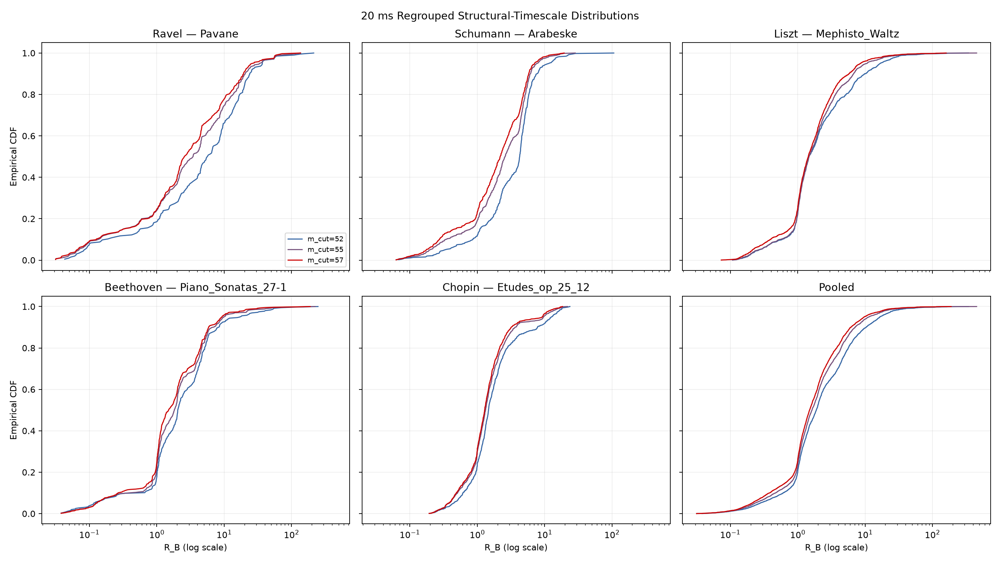

# Structural Bass Event v0 — 20 ms Regrouping Audit

## Scope and safeguards

This small audit recalculates the existing five-performance validation audit with earliest-anchor 20 ms musical-onset grouping and creates an unlabelled manual-inspection set. It does not replace or expand the original audit. No ASAP test MIDI was accessed, and no additional validation performance was added.

- Canonical split manifest: `/workspace/project/analysis/stage2_encoder_only_v0/asap_split.csv`
- Manifest SHA-256: `d1fe379eb123ff7abca93773296f735f40a215dcd6e6363b55756383708c965b`
- Inputs opened: exactly 5 specified validation performances
- ASAP test MIDI access count: **0**
- Existing exact-onset feature source: `/workspace/project/analysis/structural_bass_event_detector_v0/onset_features.csv`
- Existing exact-onset feature SHA-256: `e8d768cb5033447f0b5995be275fbf37a86daf78cf6baf23af4e07d076c8cda0`
- Tested command: `python /workspace/project/scripts/audit_structural_bass_event_detector_v0_regroup20ms.py --output /workspace/project/analysis/structural_bass_event_detector_v0_regroup20ms`

| Composer | Title | piece ID | performance |
| --- | --- | --- | --- |
| Ravel | Pavane | piece_de3f82957f1b3532 | Ravel/Pavane/ChenS03.mid |
| Schumann | Arabeske | piece_daefdda4e1923cc6 | Schumann/Arabeske/Min09M.mid |
| Liszt | Mephisto_Waltz | piece_7195bbce81550519 | Liszt/Mephisto_Waltz/Avdeeva03.mid |
| Beethoven | Piano_Sonatas_27-1 | piece_69862af5096ee3fa | Beethoven/Piano_Sonatas/27-1/Abdelmola01.mid |
| Chopin | Etudes_op_25_12 | piece_db97fbaed2036f5b | Chopin/Etudes_op_25/12/Atzinger03.mid |

## Method

Positive-velocity, non-drum note-on attacks are sorted by `(tempo-aware onset time, track index, message index)`, where track/message position is the MIDI-file order tie-break. Starting at the earliest unassigned attack, every still-unassigned attack in the inclusive interval `[anchor, anchor + 20 ms]` enters the group. The next group starts at the next unassigned attack. This is earliest-anchor grouping, not single-linkage chaining; a built-in assertion verifies that 0/15/30 ms becomes `{0,15}`, `{30}`.

Each group's representative time is its earliest attack and `p_n` is the minimum newly attacked pitch. The local timescale is the median of positive grouped-onset IOIs spanning up to eight groups on either side. For each cutoff 52/55/57, the next later grouped onset with `p_k <= cutoff` supplies gap, successor group index, strictly intervening group count `N_B`, and `R_B = gap / local median IOI`. A missing terminal successor remains blank/NA.

CC64, key-off, duration, velocity values, score annotation, voice separation, and octave-derived features are excluded from every computed feature and sampling decision.

## Exact onset versus 20 ms grouping

| Scope | old groups | new groups | group Δ% | old local IOI med s | new local IOI med s | IOI Δ% |
| --- | --- | --- | --- | --- | --- | --- |
| Ravel — Pavane | 1715 | 1063 | -38.0% | 0.0220 | 0.2551 | 1057.6% |
| Schumann — Arabeske | 2520 | 1958 | -22.3% | 0.0944 | 0.1296 | 37.2% |
| Liszt — Mephisto_Waltz | 9112 | 5408 | -40.6% | 0.0247 | 0.0982 | 297.3% |
| Beethoven — Piano_Sonatas_27-1 | 2532 | 1590 | -37.2% | 0.0214 | 0.1399 | 554.7% |
| Chopin — Etudes_op_25_12 | 2550 | 1896 | -25.6% | 0.0474 | 0.0694 | 46.5% |
| Pooled | 18429 | 11915 | -35.3% | 0.0374 | 0.1029 | 175.1% |

Each `old→new` cell below uses low-current onsets for the indicated cutoff. Complete numeric values and percentage changes are in `exact_vs_regroup20ms_comparison.csv`.

| Scope | cut | R Q1 | R median | R Q3 | R P95 | N Q1 | N median | N Q3 |
| --- | --- | --- | --- | --- | --- | --- | --- | --- |
| Ravel — Pavane | 52 | 0.91→1.53 | 19.29→5.69 | 86.23→14.66 | 322.33→36.90 | 0.0→0.0 | 2.0→1.0 | 8.0→7.0 |
| Ravel — Pavane | 55 | 0.82→1.05 | 5.62→3.46 | 64.24→10.33 | 220.51→33.67 | 0.0→0.0 | 1.0→1.0 | 4.0→3.0 |
| Ravel — Pavane | 57 | 0.82→1.04 | 7.04→2.59 | 60.86→8.83 | 190.94→26.40 | 0.0→0.0 | 1.0→1.0 | 3.0→3.0 |
| Schumann — Arabeske | 52 | 3.64→1.97 | 5.55→4.26 | 11.01→5.55 | 60.68→11.60 | 1.0→1.0 | 4.0→3.0 | 5.0→4.0 |
| Schumann — Arabeske | 55 | 1.30→1.21 | 4.28→2.58 | 7.01→4.81 | 42.74→7.72 | 0.0→0.0 | 2.0→2.0 | 4.0→4.0 |
| Schumann — Arabeske | 57 | 0.81→1.05 | 3.16→2.19 | 6.48→4.50 | 33.56→7.11 | 0.0→0.0 | 1.0→1.0 | 3.0→3.0 |
| Liszt — Mephisto_Waltz | 52 | 0.90→1.02 | 4.22→1.47 | 21.04→3.66 | 81.29→16.78 | 0.0→0.0 | 1.0→0.0 | 3.0→2.0 |
| Liszt — Mephisto_Waltz | 55 | 0.91→1.02 | 3.52→1.47 | 15.82→3.03 | 61.71→10.68 | 0.0→0.0 | 0.0→0.0 | 3.0→2.0 |
| Liszt — Mephisto_Waltz | 57 | 0.75→1.00 | 2.50→1.44 | 11.24→2.68 | 52.98→8.56 | 0.0→0.0 | 0.0→0.0 | 2.0→1.0 |
| Beethoven — Piano_Sonatas_27-1 | 52 | 0.89→1.08 | 4.03→2.05 | 25.52→4.60 | 109.39→17.27 | 0.0→0.0 | 1.0→1.0 | 3.0→2.0 |
| Beethoven — Piano_Sonatas_27-1 | 55 | 0.80→1.03 | 2.38→1.82 | 18.88→4.19 | 87.74→9.91 | 0.0→0.0 | 1.0→1.0 | 2.0→2.0 |
| Beethoven — Piano_Sonatas_27-1 | 57 | 0.80→1.00 | 2.26→1.50 | 17.33→3.85 | 77.00→9.28 | 0.0→0.0 | 1.0→0.0 | 2.0→1.0 |
| Chopin — Etudes_op_25_12 | 52 | 1.12→1.03 | 2.03→1.47 | 3.29→2.37 | 18.52→12.65 | 0.0→0.0 | 1.0→0.0 | 2.0→1.0 |
| Chopin — Etudes_op_25_12 | 55 | 0.86→0.95 | 1.72→1.33 | 2.72→2.04 | 15.16→9.62 | 0.0→0.0 | 0.0→0.0 | 1.0→1.0 |
| Chopin — Etudes_op_25_12 | 57 | 0.80→0.93 | 1.63→1.29 | 2.58→1.92 | 10.85→9.23 | 0.0→0.0 | 0.0→0.0 | 1.0→1.0 |
| Pooled | 52 | 1.04→1.06 | 3.44→1.89 | 17.30→4.65 | 90.49→16.71 | 0.0→0.0 | 1.0→1.0 | 4.0→3.0 |
| Pooled | 55 | 0.91→1.02 | 2.51→1.63 | 11.07→3.57 | 67.48→11.47 | 0.0→0.0 | 1.0→0.0 | 2.0→2.0 |
| Pooled | 57 | 0.78→0.99 | 2.17→1.50 | 8.95→3.01 | 57.71→9.78 | 0.0→0.0 | 0.0→0.0 | 2.0→1.0 |

### Ravel tail check

| cut | old R Q3 | new R Q3 | Q3 Δ% | old R P95 | new R P95 | P95 Δ% |
| --- | --- | --- | --- | --- | --- | --- |
| 52 | 86.23 | 14.66 | -83.0% | 322.33 | 36.90 | -88.6% |
| 55 | 64.24 | 10.33 | -83.9% | 220.51 | 33.67 | -84.7% |
| 57 | 60.86 | 8.83 | -85.5% | 190.94 | 26.40 | -86.2% |

## New structural-timescale distributions

| Scope | cut | low n | missing | R med | R Q1–Q3 | R P95 | N med | N Q1–Q3 |
| --- | --- | --- | --- | --- | --- | --- | --- | --- |
| Ravel — Pavane | 52 | 206 | 1 | 5.69 | 1.53–14.66 | 36.90 | 1.0 | 0.0–7.0 |
| Ravel — Pavane | 55 | 281 | 1 | 3.46 | 1.05–10.33 | 33.67 | 1.0 | 0.0–3.0 |
| Ravel — Pavane | 57 | 315 | 1 | 2.59 | 1.04–8.83 | 26.40 | 1.0 | 0.0–3.0 |
| Schumann — Arabeske | 52 | 457 | 1 | 4.26 | 1.97–5.55 | 11.60 | 3.0 | 1.0–4.0 |
| Schumann — Arabeske | 55 | 638 | 1 | 2.58 | 1.21–4.81 | 7.72 | 2.0 | 0.0–4.0 |
| Schumann — Arabeske | 57 | 727 | 1 | 2.19 | 1.05–4.50 | 7.11 | 1.0 | 0.0–3.0 |
| Liszt — Mephisto_Waltz | 52 | 1238 | 1 | 1.47 | 1.02–3.66 | 16.78 | 0.0 | 0.0–2.0 |
| Liszt — Mephisto_Waltz | 55 | 1644 | 1 | 1.47 | 1.02–3.03 | 10.68 | 0.0 | 0.0–2.0 |
| Liszt — Mephisto_Waltz | 57 | 2008 | 1 | 1.44 | 1.00–2.68 | 8.56 | 0.0 | 0.0–1.0 |
| Beethoven — Piano_Sonatas_27-1 | 52 | 357 | 1 | 2.05 | 1.08–4.60 | 17.27 | 1.0 | 0.0–2.0 |
| Beethoven — Piano_Sonatas_27-1 | 55 | 498 | 1 | 1.82 | 1.03–4.19 | 9.91 | 1.0 | 0.0–2.0 |
| Beethoven — Piano_Sonatas_27-1 | 57 | 575 | 1 | 1.50 | 1.00–3.85 | 9.28 | 0.0 | 0.0–1.0 |
| Chopin — Etudes_op_25_12 | 52 | 660 | 1 | 1.47 | 1.03–2.37 | 12.65 | 0.0 | 0.0–1.0 |
| Chopin — Etudes_op_25_12 | 55 | 850 | 1 | 1.33 | 0.95–2.04 | 9.62 | 0.0 | 0.0–1.0 |
| Chopin — Etudes_op_25_12 | 57 | 930 | 1 | 1.29 | 0.93–1.92 | 9.23 | 0.0 | 0.0–1.0 |
| Pooled | 52 | 2918 | 5 | 1.89 | 1.06–4.65 | 16.71 | 1.0 | 0.0–3.0 |
| Pooled | 55 | 3911 | 5 | 1.63 | 1.02–3.57 | 11.47 | 0.0 | 0.0–2.0 |
| Pooled | 57 | 4555 | 5 | 1.50 | 0.99–3.01 | 9.78 | 0.0 | 0.0–1.0 |

## Manual annotation candidate set

`manual_annotation_candidates.csv` contains 100 rows: exactly 20 per piece. Eligibility is `p_n <= 57` with an observed successor and local IOI. Within each piece, eligible observations are stable-sorted by empirical `R_B` and rank-partitioned into five equal-frequency strata. Four examples are selected from each stratum while balancing the three requested pitch bands and temporal position. Stratum names describe relative empirical rank only; they are not detector labels or proposed thresholds.

| Piece | total | p≤52 | p53–55 | p56–57 | R strata counts (low→high) |
| --- | --- | --- | --- | --- | --- |
| Ravel — Pavane | 20 | 7 | 7 | 6 | 4/4/4/4/4 |
| Schumann — Arabeske | 20 | 7 | 7 | 6 | 4/4/4/4/4 |
| Liszt — Mephisto_Waltz | 20 | 7 | 7 | 6 | 4/4/4/4/4 |
| Beethoven — Piano_Sonatas_27-1 | 20 | 7 | 7 | 6 | 4/4/4/4/4 |
| Chopin — Etudes_op_25_12 | 20 | 7 | 7 | 6 | 4/4/4/4/4 |

The `annotation` and `comment` columns are blank. Allowed human labels are:

- `STRUCTURAL_BASS`
- `NOT_STRUCTURAL_BASS`
- `AMBIGUOUS`

Timeline figures show −4/+8 grouped-onset context, use relative seconds on x, MIDI pitch on y, mark the candidate in red, and label each point column with relative group index:

- [manual_timeline_piece_de3f82957f1b3532.png](manual_timeline_piece_de3f82957f1b3532.png)
- [manual_timeline_piece_daefdda4e1923cc6.png](manual_timeline_piece_daefdda4e1923cc6.png)
- [manual_timeline_piece_7195bbce81550519.png](manual_timeline_piece_7195bbce81550519.png)
- [manual_timeline_piece_69862af5096ee3fa.png](manual_timeline_piece_69862af5096ee3fa.png)
- [manual_timeline_piece_db97fbaed2036f5b.png](manual_timeline_piece_db97fbaed2036f5b.png)

## Required questions

### Q1 — Did the extreme R tail shrink?

**Pooled: yes. Ravel: yes.** This judgment requires both Q3 and P95 to decrease at all three audited cutoffs; the exact magnitudes are reported above. The grouping result is therefore measured rather than assumed.

### Q2 — Is relative stability across the five pieces maintained?

**Yes descriptively: dispersion decreased at every audited cutoff.** The comparison uses the coefficient of variation of the five piece-level R medians; it is an audit diagnostic, not a pass/fail threshold for a detector.

| cut | old median range | old CV | new median range | new CV |
| --- | --- | --- | --- | --- |
| 52 | 2.03–19.29 | 0.888 | 1.47–5.69 | 0.568 |
| 55 | 1.72–5.62 | 0.394 | 1.33–3.46 | 0.372 |
| 57 | 1.63–7.04 | 0.581 | 1.29–2.59 | 0.279 |

This is a descriptive five-piece stability check, not evidence of dataset-wide invariance.

### Q3 — How do cutoffs 52/55/57 differ?

The pooled and piece-level table above gives the direct answer. Raising the cutoff changes both the eligible pitch population and which onset counts as the successor; it must not be read as a nested re-labelling of one fixed set. No cutoff is selected here.

### Q4 — Is candidate sampling sufficiently diverse?

**Yes for this annotation pilot.** Every piece contributes 4 examples from each empirical R stratum and all three pitch bands. The exact empirical R bounds are stored per row, and `candidate_sampling_summary.csv` provides auditable counts.

### Q5 — Is the audit ready for labels and later R_low/R_high estimation?

**Yes, for the requested next human-annotation step.** The sheet has balanced piece/R coverage, pitch/context fields, blank labels, and annotation-support plots. This means data preparation is ready; it does not mean either boundary is identifiable before labels are filled and reviewed.

## Non-goals and non-conclusion

This audit does not set `R_low` or `R_high`, calculate Bass Connectivity, evaluate pedal sustain, train a classifier, fit isotonic regression, calculate precision/recall, access ASAP test, or expand beyond the five performances.

## Files

- `onset_features_regroup20ms.csv`: every 20 ms grouped onset and cutoff-specific features
- `manual_annotation_candidates.csv`: 100 empty-label manual candidates
- `exact_vs_regroup20ms_comparison.csv`: exact-onset versus regrouped statistics
- `structural_timescale_distribution.csv`: new R/N/gap summaries
- `candidate_sampling_summary.csv`: candidate strata and pitch-band counts
- `selection_manifest.csv`, `audit_metadata.json`: exact inputs and audit provenance
- `R_B_distribution.png` and five `manual_timeline_*.png` figures
